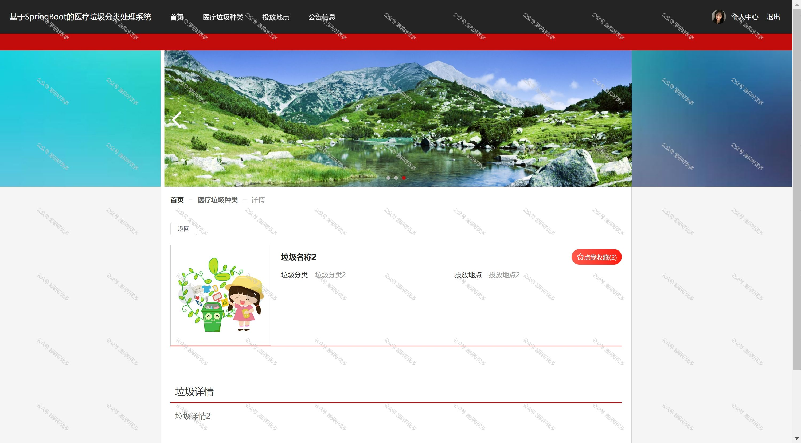

 
## 查看主页获取源码

### 一、作品包含

源码+数据库+全套环境和工具资源+部署教程

### 二、项目技术

前端技术：Html、Css、Js、Vue、Element-ui

数据库：MySQL

后端技术：Java、Spring Boot、MyBatis

  

### 三、运行环境

开发工具：IDEA/eclipse

数据库：MySQL5.7

数据库管理工具：Navicat10以上版本

环境配置软件： JDK1.8+Maven3.6.3

前端Nodejs：14

### 四、项目介绍
项目编号：springbootA157

医疗垃圾分类系统的背景在于应对医疗废物处理中的挑战和风险。医疗废物作为一种特殊的危险废物，含有病原体、有害化学物质和放射性物质，具有高度传染性和生物危害性。不当处理医疗废物不仅会对环境和公共卫生造成严重威胁，还可能引发疾病传播和资源浪费。因此，建立一套完善的医疗垃圾分类系统，对于实现医疗废物的科学管理、无害化处理和资源化利用具有重要意义，它是保护环境、保障人民群众健康的关键举措。

前台用户功能：登录注册、首页、医疗垃圾、种类投放地点、公告信息、修改密码、投诉反馈、垃圾处理流程、我的收藏。

后台分为管理员和普通管理员
管理员的功能：系统首页、用户、普通管理员、垃圾分类、医疗垃圾种类、投诉反馈、投放地点、垃圾处理流程、系统管理、个人资料。
普通管理员的功能：系统首页、投诉反馈、垃圾处理流程、个人资料。

### 五、运行截图

  
